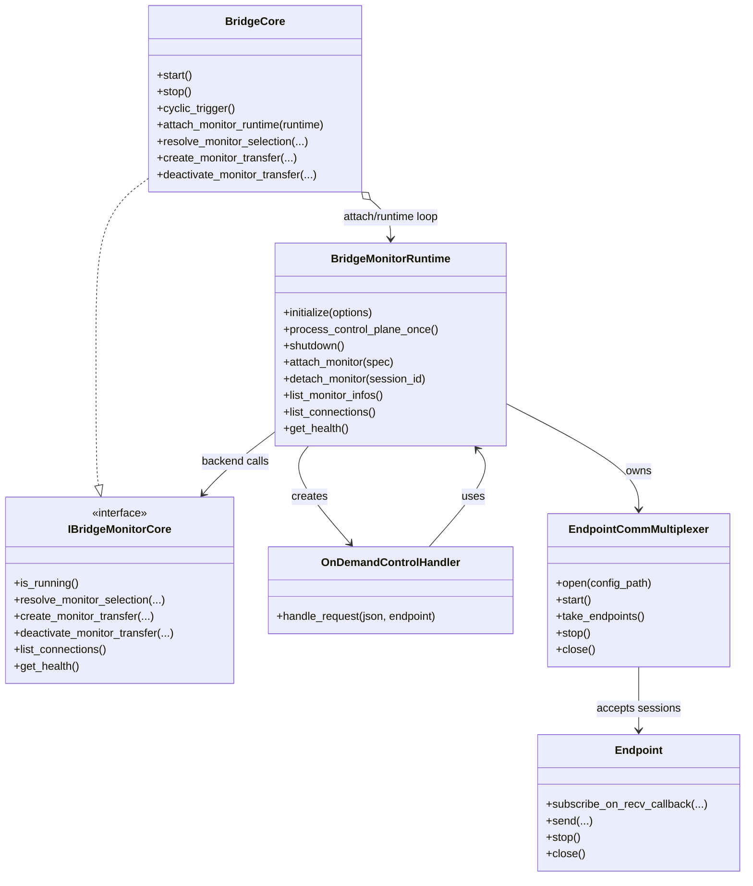

# 0. 現在の正式仕様（実装準拠 / 2026-02-21）

この章が本ファイルの **正** とする。以降の旧章は設計履歴として扱う。

## 0.1 実装スコープ

- bridge本体の転送機能（immediate / throttle / ticker）
- on-demand monitor（control plane + data plane）
- monitor CLI（health/connections/sessions/list_pdus/subscribe/unsubscribe/tail）

## 0.2 on-demand monitor の有効化

- daemon 起動時に明示指定する:
  - `--enable-ondemand`
  - `--ondemand-mux-config <path>`
- 有効化時に `ondemand mux config` が無ければ起動エラー

## 0.3 control plane（現実装）

- transport: EndpointMux 経由
- request key: `robot=BridgeControl`, `channel_id=1`
- response key: `robot=BridgeControl`, `channel_id=2`
- format: JSON request/response

サポート request:
- `health`
- `list_connections`
- `list_sessions`（`list` は互換エイリアス）
- `list_pdus`
- `subscribe`
- `unsubscribe`

注意:
- `filters` は未対応（未指定または空配列のみ許容）
- `subscribe` の既定 policy は `throttle(interval_ms=100)`

## 0.4 data plane（現実装）

- bridge独自ヘッダは定義しない
- Endpoint/Comm の既存フォーマットに委譲（Comm v2）
- monitor クライアント側で `pdu_name` / `epoch` を解決する

## 0.5 ライフサイクル（現実装）

- `BridgeCore` は monitor session 台帳を持たない
- `BridgeMonitorRuntime` が以下を管理:
  - control session（mux accepted endpoint）
  - monitor session 台帳
  - monitor transfer の attach/detach
- control session 切断検出はポーリング方式
- `stop()` 中は新規 `subscribe` を拒否

## 0.6 ログ方針（現実装）

- event: `[monitor][event] ...`
- error: `[monitor][error] ...`
- monitor CLI は `DEBUG:` 行を表示しない（ノイズ抑制）

## 0.7 monitor CLI（現実装）

コマンド:
- `health`
- `connections`
- `sessions`
- `list_pdus <connection_id>`
- `subscribe <connection_id> [policy] [interval_ms]`
- `unsubscribe <session_id>`
- `tail <connection_id> [policy] [interval_ms] [duration_sec]`

`tail`:
- 内部で `list_pdus` + `subscribe` を実行
- 終了時に `unsubscribe` を自動実行
- 表示項目:
  - `timestamp_usec`
  - `robot`
  - `channel_id`
  - `pdu_name`
  - `payload_size`
  - `epoch`（読めない場合は `N/A`）

## 0.8 source of truth（実装参照）

- runtime/control: `src/bridge_monitor_runtime.cpp`
- control handler: `src/ondemand_control_handler.cpp`
- core backend: `src/bridge_core.cpp`, `include/hakoniwa/pdu/bridge/bridge_monitor_core.hpp`
- CLI: `tools/bridge_monitor_cli.cpp`, `src/monitor_cli_utils.cpp`
- schema: `config/schema/ondemand-control-request-schema.json`, `config/schema/ondemand-control-response-schema.json`

# 1. 目的とスコープ

* 本リポジトリは `hakoniwa-pdu-bridge`を実装する
* `EndPoint` の生成・設定は **外部**（`hakoniwa-pdu-endpoint` の loader）に委譲する
* 本実装のローダーは **bridge.json のみ**を読む
* endpoint.json は読まない（必要なら参照パスを受け取るだけ）

# 2. 用語

* BridgeCore / BridgeConnection / TransferPdu / PduKey / Epoch(owner_epoch)
* src/dst endpoint
* policy(immediate/throttle/ticker)

# 3. 入出力仕様

## 3.1 bridge.jsonのスキーマ

config/schema/bridge-config.schema.json を参照


# 4. クラス設計（責務と主要メソッド）

## 4.1 BridgeDaemon(main)

* `main(args)` で `BridgeCore` を作って run

## 4.2 BridgeCore
責務:

* bridge.json をロードして `BridgeConnection` を組み立てる（組み立て自体は Loader でもOK）
* `connections` を保持し、run loop を回す

主要メソッド例:

* `load(const BridgeConfig&)`
* `run()` / `stop()`

## 4.3 BridgeConnection

責務:

* src/dst endpoint を2つ保持（参照 or shared_ptr）
* TransferPdu の配列を持つ
* `step()` で転送を実行

主要メソッド:

* `step(now)` (policy/tickerに合わせるなら now 渡し)

## 4.4 TransferPdu

責務:

* `PduKey` と `epoch/active` を持つ
* policy を持つ（strategy）
* src→dst の “単一PDU転送” を行う

主要メソッド:

* `transfer()` または `try_transfer(now)`
* `set_active(bool)`
* `set_epoch(uint64_t)`
* `accept_epoch(epoch)`（dst側で破棄判定するならここがガード）

## 4.5 PduTransferPolicy（interface）

* `bool should_transfer(now)` / `void on_transferred(now)` など

派生:

* Immediate
* Throttle
* Ticker

# 5. Runtime Delegation（epoch二重送信の扱い）

* owner切替の瞬間は旧新が同時送信しうる
* 受け側（または bridge）で **最新epoch以外は捨てる**
* 捨てる場所:

  * 推奨: `TransferPdu::accept_epoch()` で reject
  * policyには混ぜない（タイミングと整合性を分離）

# 6. 依存関係と禁止事項

* `BridgeCore` は JSON を直接知らない（Loaderに寄せる）でもよい
* endpoint生成は `hakoniwa-pdu-endpoint` の API を利用（ここで再実装しない）
* 循環参照禁止（include方向ルール）

# 7. 実装タスク分割（geminiに優しい）

1. データ構造（Config DTO）
2. Policy interface + 3実装
3. TransferPdu
4. BridgeConnection
5. BridgeCore run loop（最初は単純でOK）
6. BridgeLoader（bridge.json→BridgeCore構築）
7. 最小サンプル + テスト（可能なら）

---

# 補足

* 「ファイル構成は 1クラス1ファイル」
* 「例外は policy/ と config/ のみ」
* 「C++20、エラーハンドリングは HakoPduErrorType（または例外禁止）」
* 「まずは動く最小を作り、その後拡張」

# 単体テストの追加

- ローダーのテストが欲しい
  - スキーマをベースにした数パターンのテストコンフィグファイルの作成と読み込みテスト
- mock endpointを使ったTransferPduの動作テスト
  - immediate/throttle/tickerポリシーごとに分けてテストケースを作成
- BridgeConnectionのstep()メソッドの動作テスト
  - 複数のTransferPduが正しく動作するか確認
- BridgeCoreのrunループの基本動作テスト
  - 複数のBridgeConnectionが正しく処理されるか確認

# リファクタリングメモ

- BridgeCoreのrunループは、将来的にマルチスレッド化したい（品質安定したら）

# 監視機能設計案（EndpointMuxベース、オンデマンド / 設計履歴）

> 注意: この章は検討履歴を含む。正式仕様は「0. 現在の正式仕様（実装準拠）」を参照。

## 1. 背景

- 現状の bridge は構造的に明快だが、実行中に「いまどの接続でデータが流れているか」をオンデマンドで確認しづらい。
- ROS の `topic echo` / `topic hz` 相当の観測性を、既存責務分離（bridgeは転送タイミング、endpointはI/O）を崩さず追加したい。

## 2. 方針（要点）

- `EndpointMux` の接続待ち受け特性を使い、監視クライアント接続時だけ監視セッションを動的作成する。
- 監視セッションは対象 connection の動的 destination として attach する。
- policy はセッション確立時にクライアントが指定する（`immediate` / `throttle` / `ticker`）。
- 送信データは `robot_name + channel_id + payload` を基本とし、PDU名解決・表示はクライアント実装に委譲する。
  - クライアントが `pdudef.json` を持っていれば自己解決可能。

## 3. 監視セッションの責務分担

- bridge側:
  - 対象 connection/pdu の選択を受け付ける。
  - 動的 `TransferPdu`（または監視専用 transfer）を生成・破棄する。
  - 選択された policy に従って監視データを送出する。
  - decode/可視化はしない。
- クライアント側:
  - `pdudef.json` による `channel_id -> 表示名/型` 解決。
  - 表示形式（echo, hz, dump, GUI 等）の実装。

## 4. セッションプロトコル（最小案）

### 4.1 開始要求（クライアント -> bridge）

```json
{
  "type": "subscribe",
  "connection_id": "conn1",
  "policy": {
    "type": "throttle",
    "interval_ms": 100
  }
}
```

### 4.2 応答（bridge -> クライアント）

```json
{
  "type": "subscribed",
  "session_id": "sess-0001"
}
```

### 4.3 データフレーム（bridge -> クライアント）

- ヘッダ:
  - `timestamp_usec`
  - `session_id`
  - `connection_id`
  - `robot_name`
  - `channel_id`
  - `payload_size`
- 本文:
  - `payload`（生バイト列）

※ bridgeはpayloadの意味解釈を行わない。

## 5. BridgeCore拡張ポイント（最小API）

- `attach_monitor(session_spec) -> session_id`
- `detach_monitor(session_id)`
- `list_monitors()`

内部では `BridgeConnection` に対し監視 destination を動的追加/削除する。
（実装上は `session_spec.destination_endpoint` が指定された場合、monitor 用 `TransferPdu`
を動的生成し、既存 transfer パイプラインへ追加して送出する。）

## 6. 並行性とライフサイクル

- `cyclic_trigger()` と動的更新の競合を避けるため、`connections` 参照はスナップショット化または `shared_mutex` で保護する。
- 切断時は必ず `detach_monitor()` を呼び、関連 policy/transfer/endpoint を破棄する。
- ゾンビセッション対策として heartbeat + TTL を導入する。

## 7. 制約と安全性

- 監視セッションは read-only（bridge/endpointへの書き込み禁止）。
- 監視対象の `connection_id` と `filters` は許可制（ACL）にできる設計にする。
- デフォルト policy は `throttle` とし、`immediate` は高負荷注意で明示指定のみ許可する。

## 8. 段階的導入計画

1. フェーズ1（最小）
   - 1接続・単一filter・throttle固定で監視セッションを実装
   - attach/detach の基本動作とリソース回収を検証
2. フェーズ2
   - policy選択（immediate/ticker）対応
   - 複数filter・複数session対応
3. フェーズ3
   - ACL/認可、監視統計API、CLIツール整備

## 9. 代表窓口（Control / Introspection API）案

### 9.1 目的

- オンデマンド監視（データ面）とは別に、bridge の現在状態を問い合わせる代表窓口を用意する。
- `bridge.json` の静的情報だけでなく、実行中の健全性（稼働状態・転送実績・異常）を取得可能にする。

### 9.2 取得したい情報（最小）

- 接続情報:
  - `connection_id`, `node_id`, `active`, `epoch`, `epoch_validation`
- 転送情報（PDU単位）:
  - `robot_name`, `channel_id`, `policy_type`, `transfer_count`, `last_transfer_usec`
- 健全性情報:
  - `last_error`, `drop_count`, `epoch_mismatch_count`, `uptime_usec`

### 9.3 API（最小エンドポイント案）

- `GET /v1/health`
  - bridge全体の生存確認、バージョン、稼働時間、最終エラー要約
- `GET /v1/connections`
  - connection一覧と状態（active/epoch/policy要約）
- `GET /v1/connections/{id}`
  - 指定connectionの詳細（src/dst、監視session数、転送統計）
- `GET /v1/pdus?connection_id=...`
  - connection配下PDUの統計一覧

### 9.4 実装方針

- 読み取り専用（read-only）で開始し、制御系 API は段階導入とする。
- データは `BridgeCore` からスナップショットで取得する（ロック保持時間を短くする）。
- 監視セッション用 Mux とは分離し、軽量な代表窓口を1つ提供する。

### 9.5 想定ユースケース

- 起動後の健全性確認（設定適用・接続活性・転送の有無）
- 障害時の一次切り分け（どの connection / PDU が止まっているか）
- 運用ツール連携（CLI / ダッシュボード / アラート）

## 10. インタフェース設計（着手版）

### 10.1 接続断イベント（endpoint transport capability）

目的:
- 接続型 transport(TCP/WS) で切断を検出した際、bridge/利用者へ通知する。
- SHM/UDP は no-op でよい（切断概念が薄いため）。

最小仕様:
- `on_connected` は導入しない（初期フェーズ）。
- `on_disconnected` のみを任意機能として追加する。

通知データ:
- `endpoint_name`
- `reason_code` (`HakoPduErrorType` 相当)
- `reason_text`（短い説明）

想定 C++ シグネチャ（概念）:

```cpp
struct DisconnectEvent {
    std::string endpoint_name;
    int reason_code;
    std::string reason_text;
};

using OnDisconnected = std::function<void(const DisconnectEvent&)>;
```

運用ルール:
- コールバック内では `stop()/close()` を直接呼ばない。
- 管理スレッドへ停止要求を渡し、別コンテキストで `stop()->close()->参照解放` を行う。
- 同一切断原因の連続通知は抑制（再接続ループ中の通知スパム防止）。

### 10.2 Monitor Session API（bridge内部）

目的:
- 監視クライアント接続時に、対象 connection へ動的 destination を attach する。

セッション指定:

```cpp
struct MonitorFilter {
    std::string robot;
    int channel_id;
};

struct MonitorPolicy {
    std::string type;      // immediate | throttle | ticker
    int interval_ms = 0;   // throttle/tickerで使用
};

struct MonitorSessionSpec {
    std::string connection_id;
    std::vector<MonitorFilter> filters;
    MonitorPolicy policy;
};
```

BridgeCore 最小API:

```cpp
std::optional<std::string> attach_monitor(const MonitorSessionSpec& spec);
bool detach_monitor(const std::string& session_id);
std::vector<std::string> list_monitors() const;
```

制約:
- read-only 監視のみ（bridge/endpointへの書き込み禁止）。
- attach/detach は bridge loop と競合しない直列化経路で実行する。

### 10.3 Control / Introspection API（代表窓口）

目的:
- 実行中の状態をオンデマンド照会する（静的config参照だけに依存しない）。

応答 DTO（最小）:

```cpp
struct BridgeHealthDto {
    bool running;
    uint64_t uptime_usec;
    std::string last_error;
};

struct ConnectionStateDto {
    std::string connection_id;
    std::string node_id;
    bool active;
    uint8_t epoch;
    bool epoch_validation;
};

struct PduStateDto {
    std::string connection_id;
    std::string robot_name;
    int channel_id;
    std::string policy_type;
    uint64_t transfer_count;
    uint64_t last_transfer_usec;
    uint64_t drop_count;
    uint64_t epoch_mismatch_count;
};
```

代表窓口の read-only API（論理）:
- `get_health() -> BridgeHealthDto`
- `list_connections() -> vector<ConnectionStateDto>`
- `get_connection(connection_id) -> optional<ConnectionStateDto>`
- `list_pdus(connection_id) -> vector<PduStateDto>`

HTTP等へのマッピング例:
- `GET /v1/health`
- `GET /v1/connections`
- `GET /v1/connections/{id}`
- `GET /v1/pdus?connection_id=...`

### 10.4 段階導入（実装順）

1. `on_disconnected` 通知（TCP/WS）を追加
2. BridgeCore に monitor attach/detach API 追加（単一session, throttle固定）
3. 代表窓口 read-only API 実装（health + connections）
4. PDU統計・ACL・複数sessionへ拡張

## 11. オンデマンド要求仕様 v0（Bridge側 / 履歴）

> 注意: 本章の一部は履歴情報。現行仕様は「0章」を優先する。

### 11.1 目的

- 監視クライアントが必要なときだけ接続し、対象接続の転送データを購読できるようにする。
- 代表窓口として、接続状態・ポリシー・健全性を照会できるようにする。

### 11.1.1 起動時有効化オプション（必須仕様）

- オンデマンド機能は「起動時に有効化するか」を明示指定する。
- 有効化する場合、Mux設定ファイルのパス指定を必須とする。
- 無効化時は、monitor/control 受付を起動しない（既存 bridge 動作のみ）。

CLI想定（例）:

```text
hakoniwa-pdu-bridge <bridge.json> <delta_time_step_usec> <endpoint_container.json> [node_name]
  --enable-ondemand
  --ondemand-mux-config <path/to/comm_mux.json>
```

バリデーション:
- `--enable-ondemand` あり かつ `--ondemand-mux-config` なし: 起動エラー
- `--enable-ondemand` なし: `--ondemand-mux-config` は無視または警告（実装方針を固定する）
- 指定された Mux 設定ファイルが読めない/不正: 起動エラー

### 11.1.2 Bridge統合ランタイム

- 利用者の初期化負担を下げるため、EndpointMux 初期化・control 受信・session 管理は
  Bridge ライブラリ側 `BridgeMonitorRuntime` に集約する。
- `BridgeMonitorRuntime` は control plane と session 管理を担当し、
  monitor 操作バックエンドとして `IBridgeMonitorCore` に依存する。
- 利用者は初期化時に `BridgeMonitorRuntime` を生成し、`BridgeCore` に attach する。
- `BridgeCore` は `cyclic_trigger()` 内で `BridgeMonitorRuntime::process_control_plane_once()` を呼び出す。
- `daemon` は CLI 解析と run loop のみを担当する。

### 11.1.3 クラス図（monitor/control）



補足:
- `BridgeCore` は monitor session 台帳を持たず、monitor 用の低レベル操作のみを提供する。
- `BridgeMonitorRuntime` が control plane / session 台帳 / monitor transfer lifecycle を管理する。
- `OnDemandControlHandler` は `BridgeMonitorRuntime` を参照し、`BridgeCore` には直接依存しない。
- `IBridgeMonitorCore` の実装クラス（implementer）は `BridgeCore` である。

### 11.2 伝送レイヤ構成

- `control plane`: JSON メッセージ（要求/応答）
- `data plane`: Endpoint/Comm の既存バイナリフレーム（`comm_raw_version: v2`）
- 同一 EndpointMux 上で多重化してよいが、メッセージ種別で明確に分離する。
- Bridge 側で独自データヘッダは定義しない。`Endpoint::send()` に渡したデータは
  Comm 実装が既存ルール（MetaPdu v2 + body）でフレーミングする。
- 現行実装では control plane を固定チャネルで運用する:
  - request: `robot=BridgeControl`, `channel_id=1`
  - response: `robot=BridgeControl`, `channel_id=2`

### 11.3 Control要求

1. `subscribe`
- 入力:
  - `connection_id`
  - `filters`:
    - 現在は予約フィールド（未指定または空配列のみ許容）
    - 要素を含む指定は `UNSUPPORTED`
  - 監視対象は対象 `connection` の `transferPdus` 全件
  - `policy`: `{ "type": "immediate|throttle|ticker", "interval_ms": N }`
- 既定:
  - `policy` 省略時は `throttle(interval_ms=100)`
- 出力:
  - `subscribed` + `session_id`

2. `unsubscribe`
- 入力:
  - `session_id`
- 出力:
  - `ok`（存在しない session_id でも idempotent に `ok`）

3. `list_sessions`
- 入力: なし
- 出力:
  - 現在の monitor session 一覧

4. `list_connections`
- 入力: なし
- 出力:
  - Bridge が管理している connection 一覧（`connection_id`, `node_id`, `active`, `epoch`, `epoch_validation`）

5. `health`
- 入力: なし
- 出力:
  - `running`, `uptime_usec`, `last_error`

互換性:
- `list` は `list_sessions` の後方互換エイリアスとして当面受理する（新規実装は `list_sessions` を利用）。

### 11.4 Control応答共通フォーマット（最小）

```json
{
  "type": "ok|error|subscribed|sessions|connections|health",
  "request_id": "optional-client-id",
  "code": "optional error code",
  "hako_error": "optional numeric HakoPduErrorType",
  "message": "optional error text"
}
```

### 11.4.1 エラーコード体系（control plane）

control API の `type=error` では次の `code` を返す:

- `INVALID_REQUEST`:
  - JSON Schema違反、必須項目不足、値範囲不正
- `NOT_FOUND`:
  - `connection_id` / `session_id` が存在しない
- `BUSY`:
  - stop中、または一時的に要求を受け付けられない
- `UNSUPPORTED`:
  - 未対応 policy / 機能無効（オンデマンド未有効化）
- `PERMISSION_DENIED`:
  - ACL等で要求が許可されない（将来拡張含む）
- `INTERNAL_ERROR`:
  - 予期しない内部エラー

`hako_error`:
- 既存処理で `HakoPduErrorType` が得られる場合は数値を設定する。
- 対応する `HakoPduErrorType` が無い場合は省略可能。

### 11.5 Dataフレーム（最小）

- Bridge は独自フレームを定義しない。
- 監視データは Endpoint/Comm の既存フォーマット（v2）で送出する。
  - ヘッダ: `MetaPdu`（`packet.hpp` 定義）
  - 本文: PDU payload
- 監視クライアントは既存 Comm ルールに従って decode する。

### 11.6 セッション状態遷移

- `Created -> Active -> Draining -> Closed`
- 切断時は `Active -> Draining -> Closed` を自動遷移
- `stop()` 中は新規 `subscribe` を拒否

### 11.7 制約

- read-only（monitor/control から bridge/endpoint へ書き込みは禁止）
- attach/detach は bridge loop と競合しない直列化経路で実行
- `immediate` は高負荷のため明示指定時のみ利用推奨
- `subscribe` の既定 policy は `throttle(interval_ms=100)` とし、負荷抑制を優先する
- サーバ側 filter は現時点では提供しない（`filters` は未指定/空配列のみ許容）
- オンデマンド機能有効時のみ monitor/control API を公開する

### 11.7.1 ログ方針（monitor/control）

- イベントログは最小限とする（session connect/subscribe/unsubscribe/disconnect/shutdown）。
- 異常系は必ず出力する（request parse失敗、control request validation/unsupported、attach失敗など）。
- デバッグログは monitor/control 経路では出力しない（必要時は将来の一時的な開発用途に限定）。
- 形式は1行テキストを基本とし、prefix を固定する:
  - イベント: `[monitor][event] ...`
  - 異常: `[monitor][error] ...`

### 11.7.2 ACLフックポイント（最小）

- `OnDemandControlHandler` 入口に authorizer フックを配置する。
- フック仕様:
  - 入力: `request(json)`, `session_endpoint`
  - 出力: `bool`（許可/拒否）
- 既定動作:
  - authorizer 未設定時は全要求を許可（従来互換）
- 拒否時:
  - `type=error`, `code=PERMISSION_DENIED` を返却する。
- 本段階では ACL 本体は未実装とし、将来の差し替え点のみ提供する。

### 11.8 監視クライアント（基本機能）仕様

目的:
- まずは運用で必要な可観測性を最小実装で提供する。
- payload の型依存デコードは後段拡張とし、中身非依存で見える情報を優先する。

基本コマンド:
- `health`: bridge健全性表示
- `connections`: 接続一覧表示
- `sessions`: 現在の monitor session 一覧表示
- `subscribe`: 監視開始
- `unsubscribe`: 監視停止
- `tail`: data plane を受信してメタ情報を逐次表示

`tail` の最小表示項目:
- `timestamp`（`MetaPdu` 時刻フィールド）
- `robot_name`
- `channel_id`
- `payload_size`
- `pdu_name`（任意: `pdudef.json` を持つ場合に解決）
- `epoch`（任意: payload が Hakoniwa PDU 形式の場合のみ表示）

注記:
- Bridge は payload decode を行わない。
- `pdu_name` と `epoch` はクライアント側の解決責務とする。
- `epoch` は payload 形式が条件を満たさない場合、`N/A` 表示でよい。
